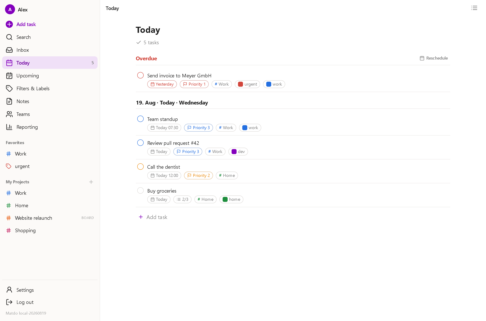
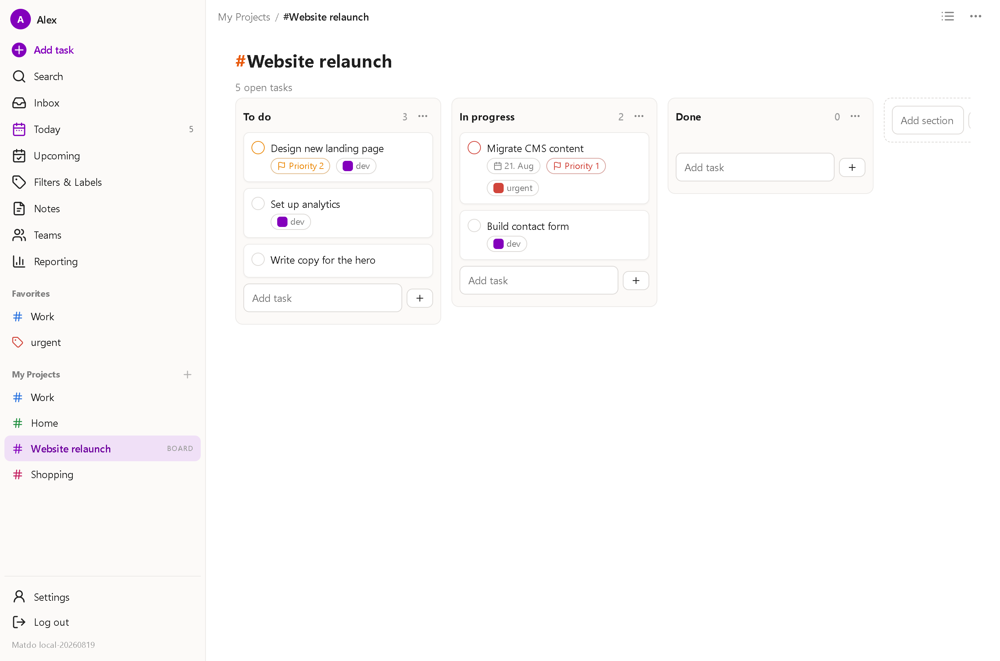
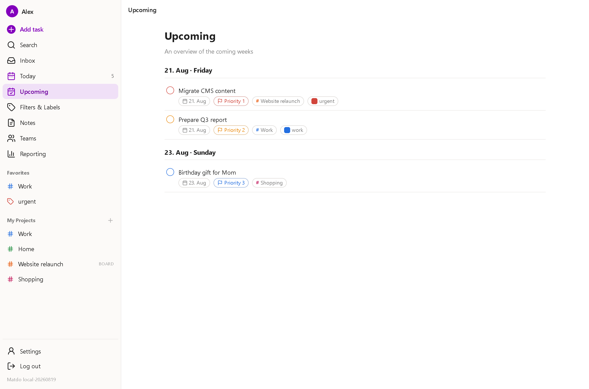
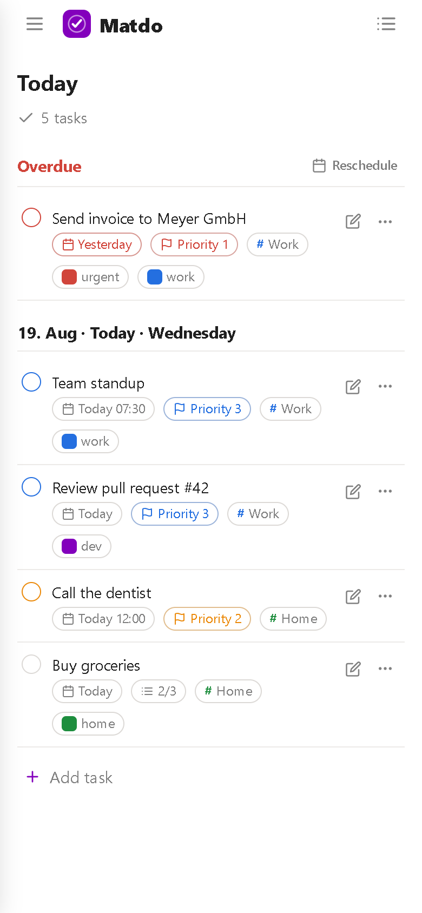
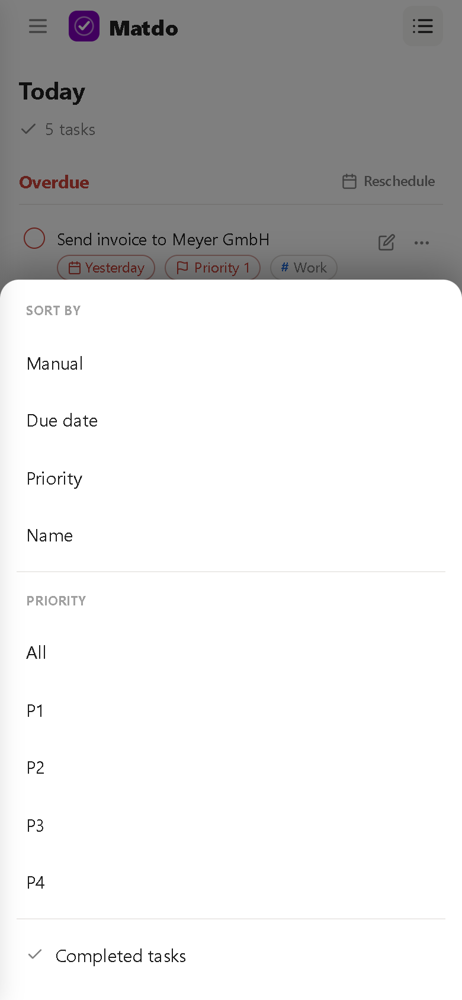

<div align="center">


# Matdo

**Your tasks, self-hosted – a Todoist-style todo app in the browser.**

Projects and Kanban boards, labels, reminders, notes, calendar sync, sharing and teams.
Installs as a **PWA** on Android and iOS. One app container plus PostgreSQL – no cloud,
no third-party services, your data stays yours.

</div>



---

## What this is about

The good todo apps have quietly moved behind paywalls and sync their data through someone
else's cloud. Matdo is a self-hosted alternative that feels familiar – the layout follows
Todoist – but runs on your own box: a task manager in the browser with projects, Kanban,
reminders by e‑mail and browser push, calendar integration, and a small user management so
family or a team can share lists. Install it to the home screen and it behaves like a native
app, offline fallback included.

## At a glance

**Tasks**
- Tasks with **sub‑tasks (steps)**, four **priorities**, **notes/description**
- **Due date** and a separate **deadline**, each with an optional time
- **Recurrence** – checking off a repeating task rolls the due date forward
- **Reminders**: a fixed time or "before due", delivered by **e‑mail** and/or **browser push**
- **Smart quick‑add**: type `Call plumber #home +urgent @lisa tomorrow 5pm` and Matdo parses the
  project, label, assignee and the natural‑language date (German and English)

**Organising**
- **Projects** with a **list** and a **Kanban** view (free columns, drag & drop), plus sub‑projects
- **Labels** (tags) and favourites
- Built‑in views: **Today**, **Upcoming**, **Inbox**, a month **calendar**, full‑text **search**
  and a small **reporting** dashboard
- **Notes** – lightweight, optionally tied to a project, pinnable
- **Reschedule overdue** in one action

**Sharing & teams**
- **Share** individual tasks or whole projects with other users (view or edit)
- **Teams** with team‑owned projects and members
- **Public board**: hand out a link and anyone can maintain a project's tasks after entering a
  name – rate‑limited, no account needed

**Calendar & interop**
- Subscribe to external calendars (**ICS**) and connect **Google**/**Microsoft** via OAuth
  (read, and optionally export Matdo tasks back into the calendar)
- Matdo publishes its own **iCal feed** per user and per project
- **Import** from Todoist (CSV template), **export** all your data as JSON (GDPR)

**Account & platform**
- Local sign‑in (e‑mail/password), **users, groups and roles**, an **admin area**
- **Per‑user time zone** – "Today"/"Overdue" and every date are computed in *your* zone
- **PWA**: installable, offline fallback, light/dark, **English and German**
- Sessions live in the database and **survive a container restart**

## Screenshots

### Projects as a Kanban board



Free columns, drag & drop, priority stripes, labels and sub‑task progress on each card. The same
project switches to a plain list with one click.

### Upcoming, grouped by day



*Today*, *Upcoming* and *Inbox* give a focused, Todoist‑style overview – overdue items float to the
top, everything else is grouped by day with priority and label chips.

### On the phone

| Task list | Filter sheet |
|---|---|
|  |  |

Installs as a PWA; menus like the display/filter options open as a full‑width bottom sheet with a
dimmed backdrop on small screens.

## Quick start

Ready‑made images are published to the GitHub Container Registry. Matdo needs a PostgreSQL
database – the compose below brings its own.

| Tag | Built from | Use it for |
|---|---|---|
| `ghcr.io/real-ttx/matdo:latest` | `main` | the current release |
| `ghcr.io/real-ttx/matdo:main-<date>-<sha>` | `main` | pinning a specific build |

### 1. Run it

Matdo deliberately has **no default database password**. Set one first, then start the stack:

```bash
export POSTGRES_PASSWORD='a-long-random-password'
docker compose -f docker-compose.public.yml up -d
```

```yaml
# docker-compose.public.yml (shipped in the repo)
services:
  db:
    image: postgres:17-alpine
    restart: unless-stopped
    environment:
      POSTGRES_USER: matdo
      POSTGRES_PASSWORD: ${POSTGRES_PASSWORD:?set POSTGRES_PASSWORD}
      POSTGRES_DB: matdo
    volumes:
      - db:/var/lib/postgresql/data
    healthcheck:
      test: ["CMD-SHELL", "pg_isready -U matdo -d matdo"]
      interval: 10s
      timeout: 5s
      retries: 5

  matdo:
    image: ghcr.io/real-ttx/matdo:latest
    restart: unless-stopped
    depends_on:
      db:
        condition: service_healthy
    environment:
      ConnectionStrings__Postgres: "Host=db;Port=5432;Database=matdo;Username=matdo;Password=${POSTGRES_PASSWORD:?set POSTGRES_PASSWORD}"
    ports:
      - "6006:6006"
    volumes:
      - data:/data

volumes:
  db:
  data:
```

Open **http://localhost:6006**. The **first account you register becomes the administrator**.
Updating is just `docker compose -f docker-compose.public.yml pull && docker compose -f
docker-compose.public.yml up -d` – the `db` and `data` volumes keep everything.

### 2. Behind HTTPS (recommended)

Put Matdo behind a TLS‑terminating reverse proxy (e.g. Caddy). **PWA install, browser push and
secure cookies all require HTTPS**; `http://<host>:6006` is fine only for a quick look.

- Tell Matdo which proxy IP(s) to trust so it reads `X‑Forwarded‑*` (and the rate limit and
  HTTPS detection work): set **`Matdo__KnownProxies`** to the proxy/Docker‑network IP(s),
  comma‑separated. Without it, forwarded headers are ignored on purpose (so nobody can spoof
  them). Example: `Matdo__KnownProxies: "172.16.0.0/12"`.
- After the first sign‑in, set the **Public base URL** under *Settings* to your HTTPS address,
  otherwise confirmation and password‑reset links point to the wrong host.

### 3. From source

```bash
docker compose up -d --build                                   # dev stack (Postgres + app)
# release/production (set a password!):
POSTGRES_PASSWORD=... docker compose -f docker-compose.yml -f docker-compose.release.yml up -d --build
```

Or build the image with the helper script (sets the displayed version):

```bash
./build.sh            # local build + deploy on port 6006
./build.ps1           # same, Windows / PowerShell
```

### Settings that matter

| Variable | Default | Meaning |
|---|---|---|
| `ConnectionStrings__Postgres` | – | PostgreSQL connection string (required) |
| `ASPNETCORE_URLS` | `http://+:6006` | Address/port inside the container |
| `Matdo__KnownProxies` | – | Trusted reverse‑proxy IP(s) for `X‑Forwarded‑*` (comma‑separated) |
| `Matdo__ConfigDir` | `/data/config` | JSON configuration (SMTP, Web‑Push) |
| `Matdo__KeysDir` | `/data/keys` | DataProtection keys (sessions survive restarts) |
| `TZ` | `Europe/Berlin` | Container time zone (per‑user zones are set in the app) |

### After the first sign‑in

*Administration* opens the admin area: **users, groups, roles, invitations and system
settings**. Configure e‑mail and push there:

- **SMTP** – enable it and enter host/port/credentials (used for reminders, e‑mail confirmation
  and password reset).
- **Web‑Push** – generate the VAPID keys; each user then turns on push under
  *Settings → Notifications*.

Registration can be **open** or **invite‑only**; either way the sign‑up response is neutral, so
it never reveals whether an address already has an account.

### The `/data` volume

```
/data
├─ config/   JSON configuration (SMTP, Web‑Push, public base URL)
└─ keys/     DataProtection keys – keep this so sessions & tokens survive a rebuild
```

The database itself lives in the separate `db` volume (PostgreSQL).

## Security

- Passwords hashed with **bcrypt**; **account lockout** and a **rate limit** on sign‑in,
  registration and password‑reset
- **No account enumeration** – sign‑in, registration and reset all answer neutrally
- **Persistent opaque sessions** in Postgres; a password change revokes all sessions
- E‑mail confirmation and password reset via one‑time tokens
- ICS calendar subscriptions go through an **SSRF guard** (no access to internal addresses,
  DNS‑rebinding‑safe)
- Secrets (SMTP, OAuth tokens) stored **encrypted** via DataProtection; CSV export is guarded
  against formula injection

## How it is built

- **ASP.NET Core 10** – Razor Pages plus a few API controllers (AJAX, push)
- **EF Core 10** with **PostgreSQL** (Npgsql); JSON for app configuration
- The interface is **plain JavaScript** (no framework, no build step); reusable UI as tag
  helpers (`list-view`, `tab-bar`, `form-field`, `icon`, …) and a custom vanilla date picker
- Custom **session authentication** – an opaque cookie token backed by a Postgres row
- **PWA**: service worker with an app‑shell cache and offline fallback, Web‑Push notifications

Source comments and the concept documents are written in German.

## Branches & versioning

| Channel | Schema | Example |
|---|---|---|
| Release | `<major>.<minor>.<build>-<yyyyMMdd>` | `0.3.7-20260819` |
| Nightly | `nightly-<build>-<yyyyMMdd>` | `nightly-7-20260819` |
| Local | `local-<yyyyMMdd>` | `local-20260819` |

`Major`/`Minor` live in [`build/version.txt`](build/version.txt); the build number comes from
CI (`github.run_number`). The version is baked in as `MATDO_VERSION` and shown in the sidebar
footer, so you can always tell which build is running. Images are published to GHCR by the
[publish workflow](.github/workflows/publish.yml) on every push to `main`.
